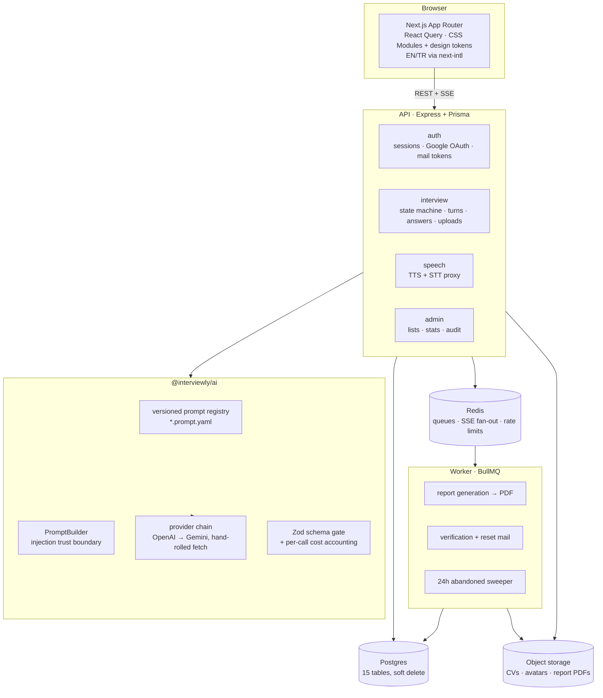
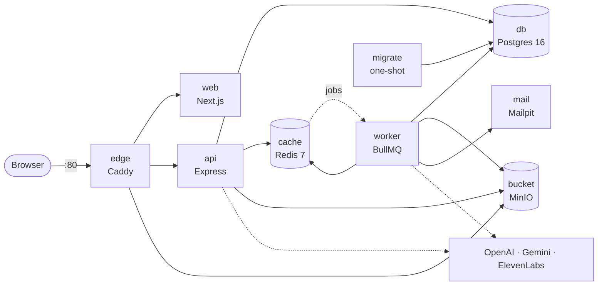
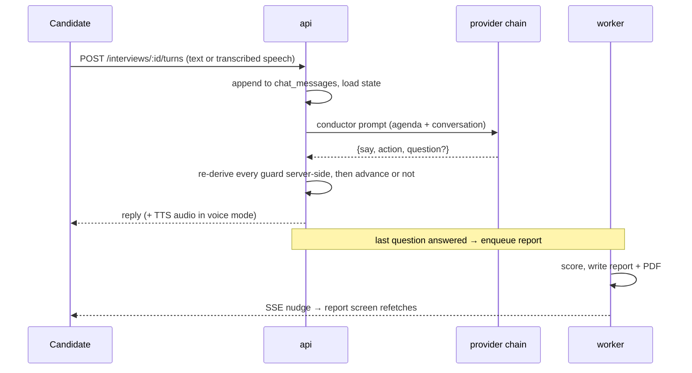

# DECISIONS

The design of Interviewly, and why it is shaped this way. The full record is 139 numbered ADRs
under `.agents/ledgers/*/DECISIONS.md`; this file is the readable summary.

## What the system does

A candidate pastes the job listing they are preparing for. The role is classified from it, the
questions are written from it, and two interviewers take a round each — **Ada** for HR, then
**Turing** for technical. Answers come by voice or by typing, each is scored with a written
reason, and a report lands at the end with per-question grades, the transcript and a PDF. An
admin console behind the same login shows every interview (deleted ones included, marked as
deleted), what each spent in tokens and dollars, and statistics by profession.

## Logical design

The rule the whole shape follows: **the server owns the truth of a session.** Round, question
index, active persona and remaining budget live in Postgres; the client renders them and never
derives them. That is what makes pause/resume, a reload mid-answer and a language switch halfway
through all behave the same way.

## Physical deployment

`edge` is the only service that publishes a host port. Everything is same-origin, so there is no
CORS anywhere in the codebase, and the CSP can stay at `default-src 'self'` with a per-request
nonce. `migrate` runs `prisma migrate deploy` and exits before `api` and `worker` are allowed to
start.

## One turn, end to end

## The four worth arguing about

**No provider SDKs.** OpenAI and Gemini are each one hand-rolled `fetch` behind a single
`AiClient` seam ([ADR-I01, I18](.agents/ledgers/interview-core/DECISIONS.md)). Two SDKs meant two
upgrade paths, two error shapes and two sets of behaviour to stub, for calls we already know how
to make. Retry is the same mechanism as fallback: tier 1 is whatever the prompt file names, tier 2
is `gemini-2.5-flash`, and a missing tier-2 key degrades the chain instead of failing the boot
([ADR-I04, I19](.agents/ledgers/interview-core/DECISIONS.md)).

**Prompts are versioned YAML files, not string literals**
([ADR-I02, I17](.agents/ledgers/interview-core/DECISIONS.md)). Each carries its model, token
ceiling and a stable lineage `uuid`; changing one means adding a `v2`, so a report generated last
week can still say which prompt wrote it. 21 files across 8 lineages so far — the honest count of
how often we changed our minds. `PromptBuilder` is the one place candidate text enters a prompt,
which makes it the injection trust boundary
([ADR-I03](.agents/ledgers/interview-core/DECISIONS.md)).

**The model proposes, the server decides.** The conductor returns JSON with an action
(`continue`, `advance`, `handover`, `end_interview`). That action derives from candidate text and
mutates interview state, so we treat it as untrusted input: five guards are re-derived
server-side every turn, including a ceiling past which the server ends or advances on its own and
writes a system row saying it did ([ADR-C02](.agents/ledgers/conductor/DECISIONS.md),
[C02](.agents/devlogs/C02-conductor-turn-loop.md)). "End the interview now" is a sentence a
candidate can type, and it does nothing.

**ElevenLabs is a TTS/STT vendor, not a conversation agent.** The first design routed the whole
interview through their agent product with webhooks — interview state in someone else's process,
and a webhook trust boundary to defend. Deleted
([ADR-S01…S05](.agents/ledgers/speech/DECISIONS.md), superseding
[ADR-V01…V04](.agents/ledgers/voice/DECISIONS.md)); two ordinary server-side calls replaced it.
Turn-taking is ours: the recorder arms against the room's own noise floor, a nano model decides
whether a pause means the candidate is finished, and six seconds of silence is a turn the
interviewer takes ([ADR-T01, T03, T07, T08](.agents/ledgers/turn-taking/DECISIONS.md)).

## The rest, in one line each

| Decision | Why | ADR |
|---|---|---|
| Monorepo on npm workspaces; Express + Prisma, not NestJS | Shared types are a package, not a copy — a rename in the API is a type error in the room. The hard parts here are prompts and state transitions, not DI. | [F03](.agents/ledgers/foundations/DECISIONS.md) |
| Every model response passes a Zod gate before it reaches the database | A malformed report marks the interview `failed` rather than writing half of one, and is never retried — a retry of an invalid shape is a slower invalid shape. | [I12](.agents/ledgers/interview-core/DECISIONS.md), [R04](.agents/ledgers/report/DECISIONS.md) |
| Question progression is a compare-and-set | A double-submitted answer cannot skip a question. | [I06](.agents/ledgers/interview-core/DECISIONS.md) |
| Reports are a queued job: BullMQ, `jobId = interviewId`, 3 retries then dead-letter | The room hears about it over SSE — native `EventSource`, one Redis subscriber per stream. `pdfkit` renders the PDF; headless Chromium would have tripled the image for one A4 page. | [R01, R03, R04](.agents/ledgers/report/DECISIONS.md), [I29, I30](.agents/ledgers/interview-core/DECISIONS.md), [W02](.agents/ledgers/frontend/DECISIONS.md) |
| Sessions are opaque DB-backed tokens, not JWTs | Sign-out has to actually sign someone out, and reset has to revoke every session an attacker might hold. A revocation list for JWTs is a session table with extra steps. | [A01, A06](.agents/ledgers/auth/DECISIONS.md) |
| Cost is recorded per call, price frozen at call time | The console reads what was spent, not what a since-moved price list implies. The budget ceiling is read in the same transaction, under an advisory lock. | [I04, I08, I33](.agents/ledgers/interview-core/DECISIONS.md) |
| Soft delete everywhere, every FK `ON DELETE RESTRICT` | The console must keep showing a deleted interview as deleted, and nothing should be able to cascade away a transcript. | [N02, N03](.agents/ledgers/admin/DECISIONS.md) |
| No Tailwind, no component library — CSS Modules over design tokens | Contrast and token usage are enforced by tests that fail the build, which is also why the CSP has no external origin. Both locales ship in the same commit: a missing key is a failing test. | [W05](.agents/ledgers/frontend/DECISIONS.md), [DESIGN.md](frontend/DESIGN.md) |

## What we knowingly left

- `answers.scores`, the four-axis breakdown, is usually `null`. `report_questions` is the reliable
  per-question grade — the pre-generation path that fills the breakdown became rare once the
  conductor owned question wording ([ADR-D02](.agents/ledgers/adaptive/DECISIONS.md)).
- Streaming responses. Every call is request/response; streaming STT is a different product, and
  we recorded that as a decision rather than a backlog item
  ([ADR-L05](.agents/ledgers/speech-latency/DECISIONS.md)).

## Where the rest of it lives

One ledger per area — `PLAN.md`, `STATE.md`, `DECISIONS.md`, tasks — and the task-ID prefix says
which one a decision belongs to.

| Prefix | Ledger | Owns |
|---|---|---|
| `F` | [foundations](.agents/ledgers/foundations/DECISIONS.md) | schema, migrations, Compose, logging, env, i18n plumbing |
| `A` | [auth](.agents/ledgers/auth/DECISIONS.md) | sessions, Google OAuth, verification and reset, onboarding |
| `I` | [interview-core](.agents/ledgers/interview-core/DECISIONS.md) | the AI package, prompts, state machine, uploads, SSE, budget |
| `R` | [report](.agents/ledgers/report/DECISIONS.md) | the worker, report jobs, PDF, the abandoned sweeper |
| `N` | [admin](.agents/ledgers/admin/DECISIONS.md) | role gate, console lists, stats, audit, the filter grammar |
| `V` → `S` | [voice](.agents/ledgers/voice/DECISIONS.md) → [speech](.agents/ledgers/speech/DECISIONS.md) | ElevenLabs; `S` supersedes `V` and `V` is not reopened |
| `T` | [turn-taking](.agents/ledgers/turn-taking/DECISIONS.md) | VAD, the completeness gate, silence windows |
| `L` | [speech-latency](.agents/ledgers/speech-latency/DECISIONS.md) | measured latency, the TTS model, what streaming is not |
| `D` | [adaptive](.agents/ledgers/adaptive/DECISIONS.md) | scoring → next-question selection, now the degradation path |
| `C` | [conductor](.agents/ledgers/conductor/DECISIONS.md) | the interviewer's turn, the agenda, the guards |
| `W` | [frontend](.agents/ledgers/frontend/DECISIONS.md) | data layer, room, report screen, console UI |
| `ADD` | [additionals](.agents/ledgers/additionals/DECISIONS.md) | everything asked for after the plan was written |

How these were built, and what they cost, is in [AI_DEVLOG.md](AI_DEVLOG.md); the per-task
write-ups are in [`.agents/devlogs/`](.agents/devlogs/).
